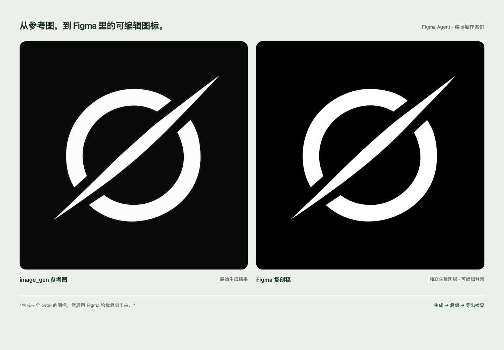
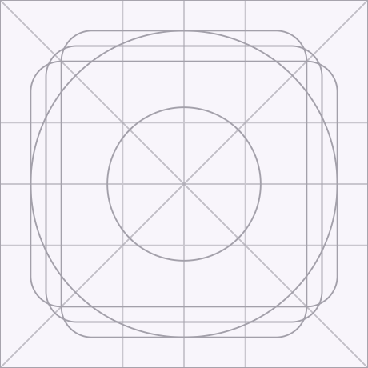

<div align="center">

# Figma Agent

**在 Codex 里说需求，在 Figma 里得到可编辑的设计。**

[开始使用](#开始使用) · [实际效果](#实际效果) · [Skill](skills/figma-agent) · [MIT](LICENSE)

</div>



## 初心

试过 Figma MCP 和 Codex 自带的 Figma 插件，还是觉得不够顺手，也不够智能。想让 agent 帮我设计，结果经常要自己拆步骤、传信息、反复连接。

所以自己做了一套 **CLI + Figma 插件 + Skill**。让 Codex 直接在画布里画界面、做图标、调整细节，再导出结果检查。换个对话，也能接着用。

## 开始使用

准备好 **Codex、Figma 桌面版和 [Node.js 22+](https://nodejs.org/)**。下面以 macOS 为例，使用系统自带的 `curl` 和 `tar`。

**1. 一条命令安装**

```sh
curl -fsSL https://raw.githubusercontent.com/Lincb522/figma-agent-cli/main/install.sh | sh
```

它会安装 CLI、Figma 插件文件和 Codex Skill，启动后台桥接，然后显示 **六位配对码** 和 **插件文件路径**。无需手动下载仓库、安装 npm 依赖或构建，完成后可以关闭终端。

**2. 在 Figma 里绑定一次**

打开一个设计稿，进入 **Plugins → Development → Import plugin from manifest…**，选择安装提示里的 `manifest.json`。

运行 **Figma Agent**，输入配对码，点击 **连接**。配对码十分钟内有效；过期后让 Codex 获取新码即可。

**3. 回到 Codex，说出需求**

安装后新开一个 Codex 对话，输入：

```text
$figma-agent 帮我设计一个音乐 App 首页，保留可编辑图层，完成后导出检查。
```

Skill 会检查工具和连接；工具缺失时自动下载，桥接未启动时自动启动，需要绑定时获取配对码并引导你操作。

**绑定会记住，意外断线会自动重连。** 换设计稿时，在目标文件里打开 Figma Agent 就行，无需重新配对。每个要操作的文件仍需运行插件；如果手动停止了重连，点击「重试连接」恢复。

<details>
<summary>已经下载了仓库？</summary>

在项目目录运行：

```sh
npm run skill:install
```

这会使用当前目录里的工具，安装 Skill 并启动桥接。已有不同版本的 Skill 时，用下面的命令先备份再替换：

```sh
npm run skill:install -- --update
```

替换插件文件后，在 Figma 中关闭并重新打开插件。升级到 0.6.0 时，还需重启一次本地桥接以识别新增的交互命令。保留项目的 `.figma-agent` 目录，以保留绑定。

</details>

## 可以让它做什么

- **界面设计**：从零画页面，或修改已选中的设计，保留可编辑文字、布局和组件。
- **图标设计**：小图标、App Icon、Keyline 构造底板，用布尔运算合并、挖空和调整轮廓。
- **交互动画**：点击、悬停、拖拽、页面跳转、弹层与组件状态切换，配置 Smart Animate、滑入和弹簧缓动，在 Figma 原型预览中操作。
- **看图复刻**：直接给参考图，或先用 image_gen 生图，再在 Figma 中重建可编辑图层。生图需要当前 Codex 提供 image_gen 工具。

```text
$figma-agent 修改我选中的页面，优化排版和间距，保留原有内容。
```

```text
$figma-agent 做一套相机 App 小图标，再做一个带构造底板的 App Icon，用布尔运算完成造型。
```

```text
$figma-agent 先用 image_gen 生成一个播放器界面，再复刻到 Figma，文字、按钮和布局保持可编辑。
```

```text
$figma-agent 给这个页面加交互：开关点击后用弹簧动画切换，卡片悬停抬起，点击详情从右侧滑入。
```

## 实际效果

上方图片来自一次实际操作：

> 生成一个 Grok 的图标，然后用 Figma 给我复刻出来。

左侧是 image_gen 生成的参考图，右侧是 **Figma 实际导出的复刻稿**，圆环、斜线和背景可以分别编辑。

[查看 PNG](docs/showcase/grok-figma.png) · [查看 SVG](docs/showcase/grok.svg)

<p align="center"></p>

图标的构造辅助线、主体和着色背景分开保留，方便继续调整，也能单独导出干净的图标。

---

[CLI 用法](docs/CLI.md) · [图标设计](docs/ICONS.md) · [交互动画](docs/PROTOTYPES.md) · [图片复刻](docs/IMAGEGEN.md) · [验证记录](docs/VERIFICATION.md) · [MIT License](LICENSE)
