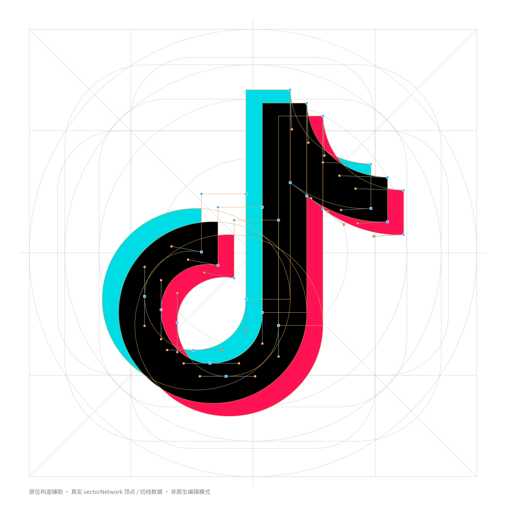
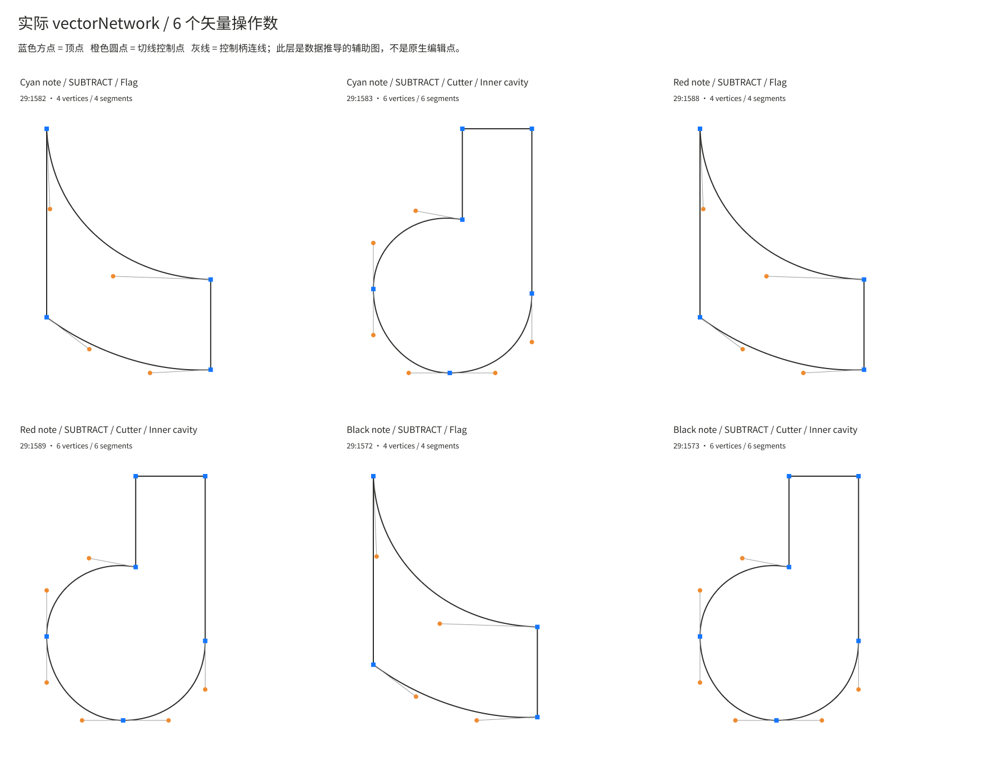
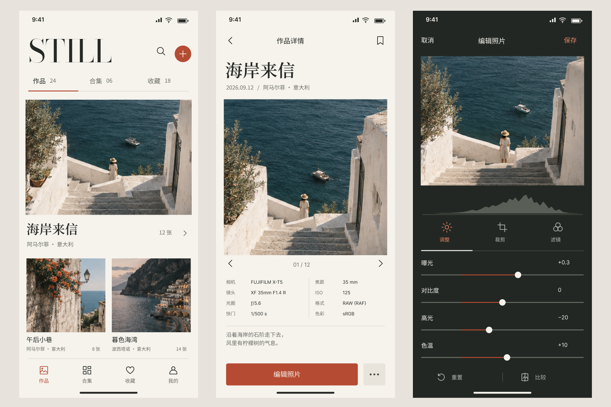
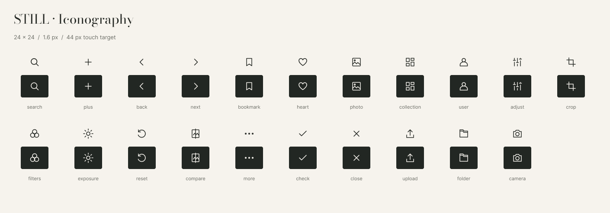

<div align="center">


# Figma Agent

**让 Agent 调用 Figma，把想法做成可编辑的设计。**

从页面、图标到原型交互，再把设计交回 Agent 继续开发。


[](LICENSE)

[开始使用](#开始使用) · [抖音图标完整示例](#一个图标从参考图到可编辑结构) · [Skill](skills/figma-agent) · [使用文档](docs/CLI.md)

</div>

[](docs/showcase/figma-agent-intro.mp4)

<p align="center"><a href="docs/showcase/figma-agent-intro.mp4">观看介绍 · 1 分 40 秒 · Agent 与 Figma 同屏实录</a><br/><a href="docs/showcase/cover-landscape.png">横版封面</a> · <a href="docs/showcase/cover-portrait.png">竖版封面</a></p>

## 为什么做这个

用过 Figma MCP 和 Codex 自带的 Figma 插件，还是觉得不够顺手，也不够智能。明明想让 Agent 帮忙设计，却总要自己拆步骤、传信息、反复连接。

于是做了这套 **CLI + Figma 插件 + Skill**。希望 Agent 能真正参与设计：画出来，检查细节，继续修改，再把结果接回开发。

**不局限于 Codex。** 能执行本地命令、读写文件的 Agent 都可以接入；支持 Skill 就加载技能，也可以直接读取 CLI 指南使用。

## 一个图标，从参考图到可编辑结构

用抖音图标走完一次真实流程：Agent 调用 `image_gen` 生图，在 Figma 中重建几何形状，再完成布尔组合、三色叠合与构造展示。

| 生图参考 | Figma 可编辑成品 |
| :---: | :---: |
|  |  |

**完整图标留在原位，构造也看得清。** 白色 Keyline 底板包含比例线、同心圆和圆角框；几何轮廓、顶点与控制柄叠在图标上，三色图层保持原有相对位置。



<details>
<summary><strong>展开看几何原件、布尔组合与拆解</strong></summary>

| 几何原件 | 布尔组合 |
| :---: | :---: |
|  |  |



</details>

这份示例保留 **6 个原生布尔节点**，主体没有用图片填充，也没有压平。构造点来自实际矢量数据，作为独立辅助层显示。

**[查看完整过程、素材与脚本 →](examples/douyin-icon/README.md)** · [下载 SVG](examples/douyin-icon/result.svg)

<sub>这是非官方复刻练习。节点辅助图不等同于 Figma 原生矢量编辑模式；SVG 是交换文件，原生布尔层级以 Figma 结构与示例回读记录为准。</sub>

## 开始使用

准备好 **Figma 桌面版、Node.js 22+，以及能执行本地命令的 Agent**。以下安装命令以 macOS 为例。

### 1. 安装工具和 Skill

```sh
curl -fsSL https://raw.githubusercontent.com/Lincb522/figma-agent-cli/main/install.sh | sh
```

安装器会准备 CLI、插件与 Skill，启动后台桥接，并显示 **六位配对码** 和 **manifest.json 路径**。默认安装到 Codex 的 Skill 目录，完成后可以关闭终端。

<details>
<summary>使用其他 Agent，或已经下载仓库？</summary>

指定宿主支持的技能目录：

```sh
curl -fsSL https://raw.githubusercontent.com/Lincb522/figma-agent-cli/main/install.sh | sh -s -- --skills-dir /你的Agent技能目录
```

从本地仓库安装：

```sh
npm run skill:install
```

更新已有本地 Skill，先备份再替换：

```sh
npm run skill:install -- --update
```

不支持 Skill 的 Agent，可读取安装提示中的 CLI 指南：

```sh
node /安装时显示的CLI路径 agent
```

</details>

### 2. 在 Figma 中绑定一次

打开设计稿，进入 **Plugins → Development → Import plugin from manifest…**，选择安装提示里的 `manifest.json`。运行 **Figma Agent**，输入配对码并连接。

配对码十分钟内有效。过期或首次缺少连接时，让 Agent 获取新码并引导绑定即可。**绑定会保存，意外断线会自动重连。** 换文件后，在目标文件里运行插件；每个要操作的文件仍需打开插件。

### 3. 直接描述设计需求

Codex 用户安装后新开一个对话，例如：

```text
$figma-agent 帮我设计一个摄影 App 首页，完成后检查排版，再配置作品详情和收藏状态的交互。
```

其他 Agent 按宿主方式加载 `figma-agent/SKILL.md`，描述需求即可。Skill 会检查工具与连接，缺少工具时下载，桥接未启动时启动，需要绑定时获取配对码。

## 可以一起完成的设计工作

| 能力 | 可以这样提出需求 |
| --- | --- |
| **UI 设计** | 设计首页和详情页，保留可编辑文字、布局与组件。 |
| **图标设计** | 做一套小图标和 App Icon，加上构造底板，继续调整轮廓。 |
| **原型交互** | 给收藏按钮加状态切换，配置页面跳转、弹层与 Smart Animate。 |
| **看图复刻** | 先生成参考图，再重建成 Figma 图层；也可以直接提供已有图片。 |
| **设计转代码** | 导出代码、素材和图层信息，让 Agent 根据当前项目技术栈继续实现。 |

生图需要宿主提供 `image_gen` 工具。代码交接包包含 HTML/CSS、可选 React 组件、图片、SVG、图层结构与 Figma 预览；响应式布局和业务逻辑由 Agent 结合项目完成。

<details>
<summary><strong>更多实际效果：STILL 摄影 App</strong></summary>

从参考图重建首页、作品详情与照片编辑页，文字、图片和控件保留独立图层。





<p align="center"></p>

</details>

---

[CLI 用法](docs/CLI.md) · [图标设计](docs/ICONS.md) · [原型交互](docs/PROTOTYPES.md) · [图片复刻](docs/IMAGEGEN.md) · [验证记录](docs/VERIFICATION.md)

开发者 **[zijiu522](https://github.com/Lincb522)** · [MIT License](LICENSE)
